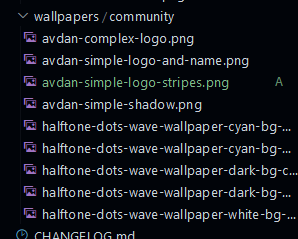

# AvdanOS Design Contributing Guide

## How to commit your designs

In order to commit your designs you will need either [**a modern browser**](#using-a-browser-does-not-require-the-files-to-be-downloaded) or [**Visual Studio Code and Git**](#vscode-with-git) (recommended) installed. (both require a PC)

### You need a GitHub account in order to add your designs to the repository.

## Visual Studio Code and Git (recommended)

Using Visual Studio Code and Git is an easy way to add your wallpapers to the repository. You can install Visual Studio Code for your operating system [here](https://code.visualstudio.com/download). You can install Git [here](https://git-scm.com/downloads).

---

1. Open Visual Studio Code 
2. Open Terminal (Either it's open already or you can manually open one using `Terminal > New Terminal`)
3. Fork the Github project by clicking on the `Fork` button on the top of the page.
4. Copy the forked repo's URL

5. Go back to `Visual Studio Code > Terminal`.
6. (OPTIONAL) Create a new folder for the project called `projects` if you haven't already (`mkdir projects` then `cd projects`, works on all operating systems)
7. Paste the command: `git clone <forked repo URl>`
   

8. Open the folder that the command created by using this command: `cd design` (if you created a folder, the command is `cd projects/design`) then `code .`.
Doing that will ask you if you trust the authors of the folder. Click "Yes, I trust the authors".

9. Drag and drop your desired file(s) you created into the correct folder (`wallpapers/community` for example) 

10. Add a new entry to the [Changelog](CHANGELOG.md) by following the given format.

11. Once you have completed that, open the Git tab in Visual Studio Code as seen below;

12. In the message tab write a small message such as "Added some wallpapers, XX.XX.XXXX"
13. Click on Commit
14. If you are not logged in, it will ask you for authentication with GitHub. Follow the process and accept the prompts.
15. Click "Yes" if it says "No Stashed Changes"
    

16. Click Sync
17. Done! You have now added your designs to your fork! Now follow the [How to create a push request](#how-to-create-a-push-request) guide in order for it to be reviewed and added by the team members.

## Using a browser

1. Open the GitHub repository
2. Fork it by click the `Fork` button on the top of the page.
3. After doing that, you should see this page;

4. Click "." (period/dot) on your keyboard. This will launch a special web version of Visual Studio Code.
5. You now should see this;

6. Drag and drop your desired file(s) you created into the correct folder (`wallpapers/community` for example). The file you added should now show up and should be highlighted in a green color.

7. Add a new entry to the [Changelog](CHANGELOG.md) by following the given format.

8. Open the Visual Studio Code (Git) tab

9. In the message tab write a small message such as "Added some wallpapers, XX.XX.XXXX"
10. Click the checkmark.
11. Done! You have now added your designs to your fork! Now follow the [How to create a push request](#how-to-create-a-push-request) guide in order for it to be reviewed and added by the organization members.

## How to create a Pull Request
1. Add your files (see guides above)
2. Go to the GitHub page
3. Click the "Contribute" button
4. Click on "Open pull request"

5. Click "Create pull request"
6. Accept the terms (Already pasted in the description)
7. Click "Open Pull Request".

You have now forked the repository, added your designs and created a pull request with them. Now, you just have to wait for a team member to review your pull request and merge it into the main repository.

---

Even if you're in the organisation, pull requests should be reviewed and approved by another member before merging, with exceptions of fixing a build fail or security patch. Complete redesign of an existing webpage will need approval from a Team Leader.

---

