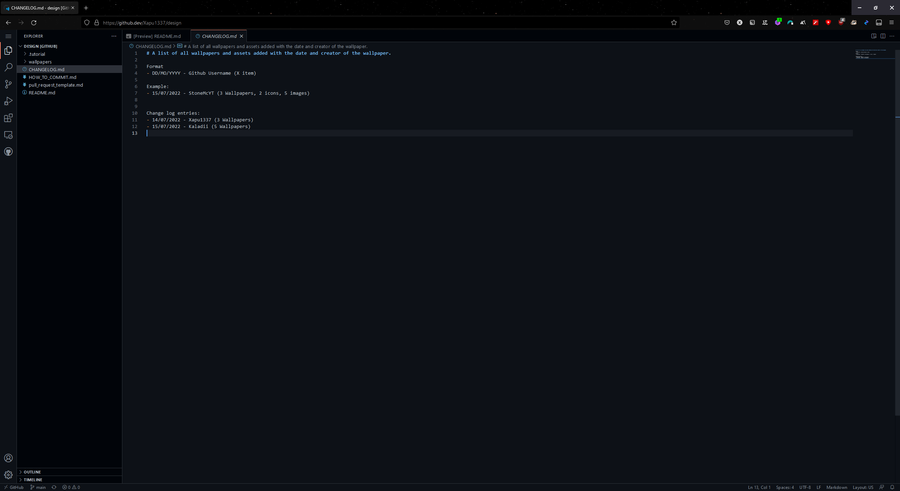

# design
A public repo for people to upload their AvdanOS assets 

 
Please create a folder for each asset and make a pull request to submit your wallpaper, icons etc
eg 
design/wallpapers 
design/icons

## How to commit your files.

Inorder to commit your files you will either need [**a modern browser**](#using-a-browser-does-not-require-the-files-to-be-downloaded) or [**visual studio code with git**](#vscode-with-git) installed. (both require a PC)

# VSCode with Git

Using VSCode and Git is a easy way to add your files and commit them

1. Open VSCode 
2. Open the Terminal (Either its open already or open manually using Terminal > New Terminal)
3. Fork the Github project
4. Copy the project URL (THE FORKED ONE NOT THE OFFICIAL ONE!)    

5. After you did that go back to VSCode and go to the terminal.
6. (OPTIONAL) Create a new folder for the project (`$ mkdir projects` (works both in Windows and Linux))
7. Paste the command: `$ git clone <project url you copied>`
   

8. Open the folder that git clone created (If you did the optional path its at `<folder you created via terminal>/design`).

    doing that will ask you for a confirmation, just click "I trust the Authrors"

9. Drag and drop your desired file you created into the fitting folder (wallpapers/community for example) 

10. Add a new entry to the [Changelog](CHANGELOG.md) (Follow the given format)

11. once you completed that, open the git tab in VSCode

12. In the message tab write a small message like "Added some wallpapers, XX.XX.XXXX"
13. Press Commit
14. (IF NOT LOGGED IN) it will ask you for a authetification, follow the automatic process and accept the prompts
15. Press yes if it says "No Stashed Changes"
    

16. Press Sync
17. Done! now follow the [How to create a push request](README.md#how-to-create-a-push-request) section

# Using a browser (Does not require the files to be downloaded)

1. Open the Github project
2. Fork it
3. After doing that, you should see this page

4. Press "." (this will launch a browser only instane of VSCode)
5. You now should see this:

6. Drag and drop your desired file you created into the fitting folder (wallpapers/community for example)
   The file you added should now show up and should be highlighted in a green color

7. Add a new entry to the [Changelog](CHANGELOG.md) (Follow the given format)

8. Open the VSC (Git) tab

9. Give it a fitting name (Like "Adding some wallpapers, XX.XX.XXX")
10. Press the checkmark.
11. Done! now follow the [How to create a push request](README.md#how-to-create-a-push-request) section

## How to create a push request
1. Add your files [See section above](#how-to-commit-your-files)
2. Go to the github page
3. Find the "Contribute" button
4. Press "Open pull request"

5. Press "Create pull request"
6. Accept the terms (Already pasted in the description)
7. Create pull request

 Avdan OS Design Repository by <a xmlns:cc="http://creativecommons.org/ns#" href="https://github.com/Avdan-OS" property="cc:attributionName" rel="cc:attributionURL">Avdan-OS</a> is licensed under a <a rel="license" href="http://creativecommons.org/licenses/by-nc/4.0/">Creative Commons Attribution-NonCommercial 4.0 International License</a>. Based on a work at <a xmlns:dct="http://purl.org/dc/terms/" href="https://github.com/Avdan-OS/design" rel="dct:source">https://github.com/Avdan-OS/design</a>.
